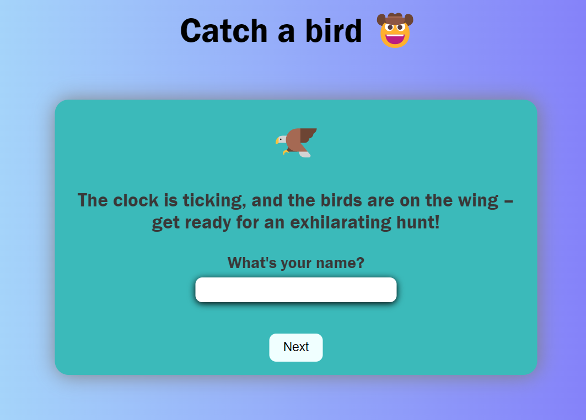

🌟 About
This project is for educational porpuses only. 

Site published at: https://laimalp.github.io/

🎯 Project features/goals

## Overview 

- Enter Your Username: Start by entering your desired username. Your username will be displayed throughout the game, adding a personal touch to the experience.
- Play the Game: Once you've entered your username, click the "Start Game" button. A bird will start moving across the screen.
- Click to Score: Your goal is to click on the moving bird as many times as possible within the given time limit. Each click adds to your score.
- Timer Countdown: Keep an eye on the timer displayed on the screen. The game lasts for a set time, adding a sense of urgency to the challenge.
- Winning the Round: To win the round, you must accumulate more clicks on the bird than the specified threshold before the timer reaches zero.
- Displaying the Winner: At the end of the game, a message will pop up indicating whether you won or lost based on your performance. If you clicked the bird enough times, congratulations, you're the winner! Otherwise, you can try again for a better score.

